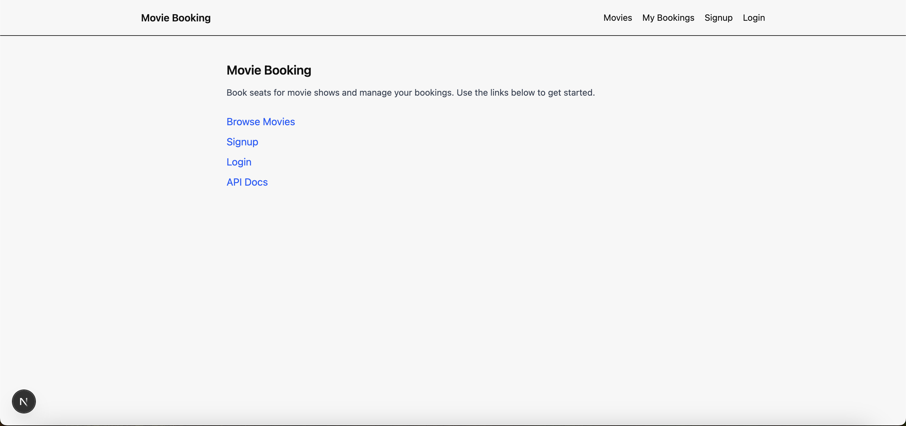
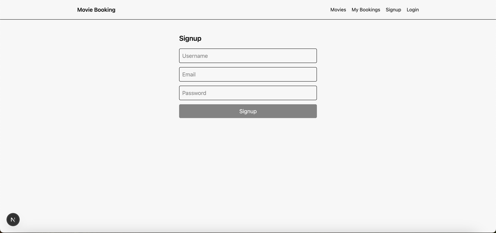
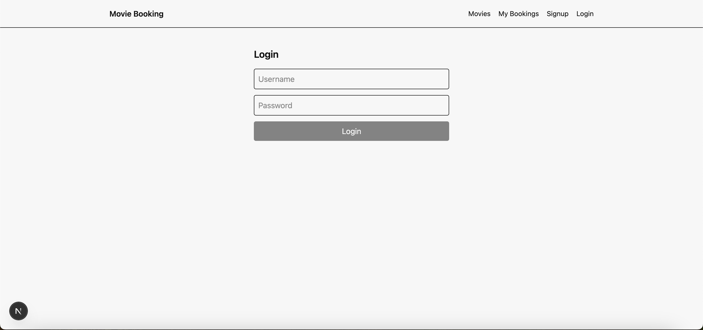
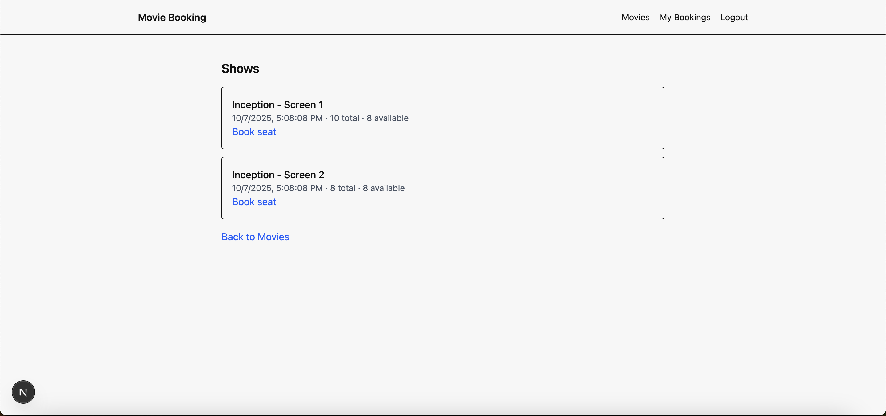
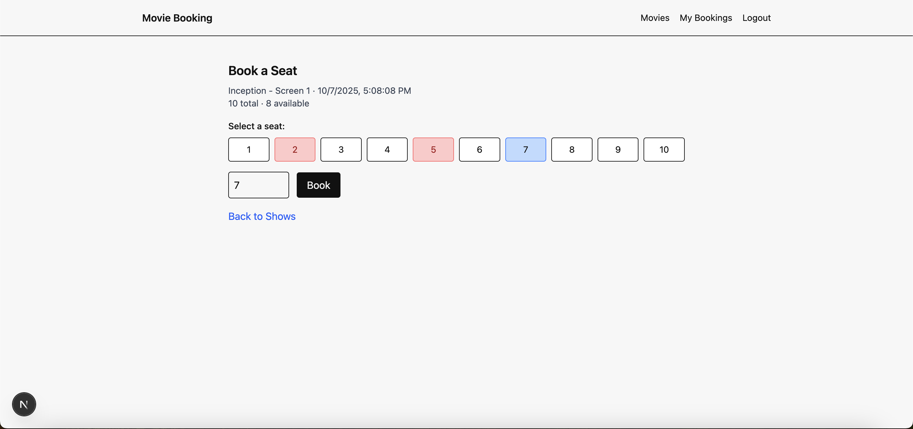
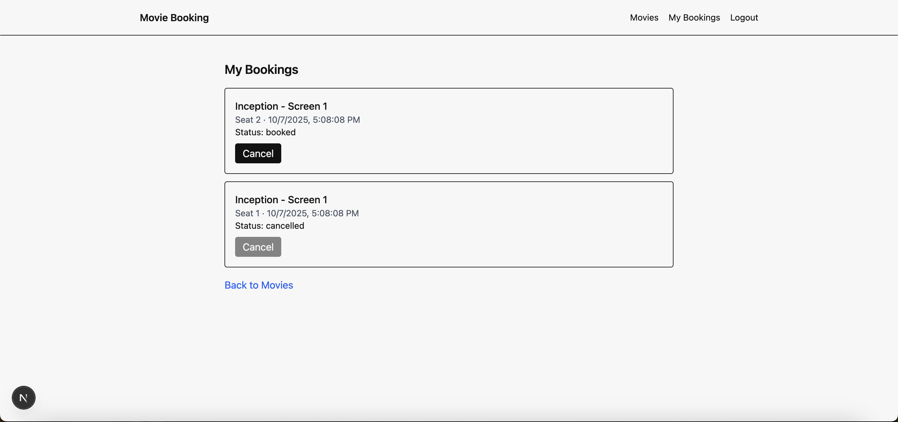
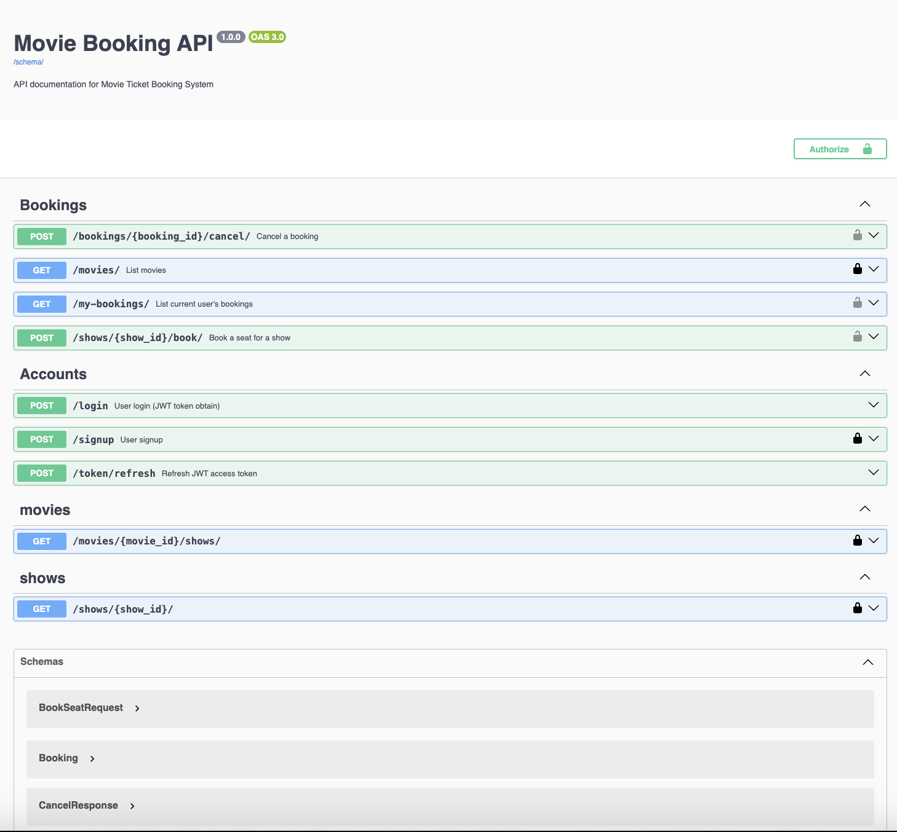

# Movie Booking – Full-Stack

A clean and secure Movie Ticket Booking System with a Django REST API and a Next.js frontend. This README provides setup, usage, API overview, testing, and submission artifacts to demonstrate all required flows.

## Project Overview
- Backend: Django 5, Django REST Framework, JWT (SimpleJWT), Swagger (drf-spectacular)
- Frontend: Next.js (App Router) with TypeScript and Tailwind CSS
- Database: SQLite (sufficient for assignment). Models: Movie, Show, Booking
- Authentication: JWT access + refresh tokens via SimpleJWT
- Testing: DRF APITestCase covering booking validation and cancellation

## Repository Structure
- backend/ — Django project and apps
- frontend/ — Next.js app

## Prerequisites
- Python 3.11+ (tested with 3.13)
- Node.js 18+

## Backend Setup
1. Navigate to backend
   - cd backend
2. Create virtualenv (optional) and install dependencies
   - python3 -m venv .venv && source .venv/bin/activate
   - pip install -r requirements.txt
3. Apply migrations
   - python manage.py migrate
4. Start dev server
   - python manage.py runserver 8010
5. Swagger docs
   - Open http://localhost:8010/swagger/

## Frontend Setup
1. Navigate to frontend
   - cd frontend
2. Install dependencies and start dev server
   - npm install
   - npm run dev
3. Open http://localhost:3000

## Environment Variables
Frontend uses NEXT_PUBLIC_API_BASE for API base URL.
- default: http://localhost:8010
- to change: echo 'NEXT_PUBLIC_API_BASE="http://localhost:8010"' >> frontend/.env.local

## Core Features (UI + API)
- Sign up: /signup → POST /signup
- Login: /login → POST /login returns JWT tokens
- Browse movies: /movies → GET /movies/
- View shows for a movie: /movies/[id]/shows → GET /movies/<id>/shows/
- Book seat for a show: /shows/[id] → POST /shows/<id>/book/, with seat availability and a visual seat grid
- View and cancel bookings: /my-bookings → GET /my-bookings/ and POST /bookings/<id>/cancel/
- Swagger API docs: / (redirect to /swagger)

## Booking Rules
- Seat number must be within 1..total_seats
- A seat cannot be double-booked while status=booked
- Cancelling a booking changes status to cancelled, freeing the seat

## API Endpoints
- GET /movies/ — list movies
- GET /movies/<movie_id>/shows/ — list shows for a movie (includes available_seats)
- GET /shows/<show_id>/ — show details including booked_seats and available_seats
- POST /shows/<show_id>/book/ — book a seat (requires JWT Authorization)
- POST /bookings/<booking_id>/cancel/ — cancel your booking (requires JWT Authorization)
- GET /my-bookings/ — list current user's bookings (requires JWT Authorization)
- POST /signup — user registration
- POST /login — JWT token obtain
- POST /token/refresh — refresh JWT access token
- Swagger: /swagger

## Screenshots

- Home page:

  

- Signup page:

  

- Login page:

  

- Movies page:

  

- Shows page:

  

- Book a Seat page:

  

- My Bookings page:

  

- Swagger UI:

  

## Testing
Run backend unit tests:
- cd backend
- python3 manage.py test
Expected output: tests pass (double booking prevention, seat range validation, cancel ownership).

## Notes for Reviewers
- CORS is enabled for local development consumption.
- SQLite is used for assignment speed; for stronger concurrency, switch to PostgreSQL and add select_for_update/transactional patterns already present in code.
- Access token refresh is handled seamlessly in the frontend (api.ts), clearing tokens on failure and updating navbar instantly via a custom auth change event.

## How to Use (End-to-End)
1. Sign up at /signup
2. Log in at /login (Authorization header set automatically)
3. Browse /movies and choose a movie
4. Visit /movies/<id>/shows and pick a show
5. Open /shows/<id>, select an available seat, and book
6. Visit /my-bookings to view and cancel a booking

## Known Limitations
- SQLite concurrency is adequate for demos; PostgreSQL recommended for production.
- UI is intentionally simple, optimized for clarity and speed.

